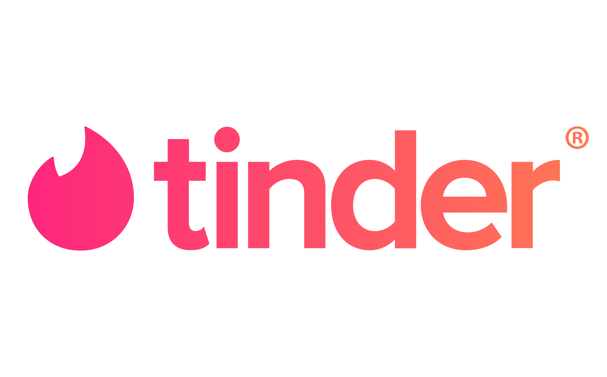

# Tinder Speed Dating ⏱️

   

## Description

[Tinder](https://tinder.com/fr) is an online dating and geosocial networking application. In Tinder, users "swipe right" to like or "swipe left" to dislike other users' profiles, which include their photos, a short bio, and a list of their interests. Tinder was launched by Sean Rad at a hackathon held at the Hatch Labs incubator in West Hollywood in 2012. As of 2021, Tinder has recorded more than 65 billion matches worldwide.

Tinder is experiencing a decrease in the number of matches, and we are trying to find a way to understand what makes people interested into each other. We decide to run a speed dating experiment with people who had to give Tinder lots of informations about themselves that could ultimately reflect on ther dating profile on the app. We then gathered the data from this experiment. Each row in the dataset represents one speed date between two people, and indicates wether each of them secretly agreed to go on a second date with the other person.

We'll use the dataset to understand what makes people interested into each other to go on a second date together.

## Notebooks

| Name | Description |
|:-|:-|
| [_00_eda.ipynb_](./notebooks/00_eda.ipynb) | Who are the participants ? |
| [_01_analysis.ipynb_](./notebooks/01_analysis.ipynb) | Which attributes do participants place most importance on when deciding to see a partner again ? |
| [_02_analysis.ipynb_](./notebooks/02_analysis.ipynb) | Can people accurately predict their own perceived value in the dating market ? |
| [_03_analysis.ipynb_](./notebooks/03_analysis.ipynb) | Are shared interests more important than a shared racial background ? |
| [_04_analysis.ipynb_](./notebooks/04_analysis.ipynb) | In terms of getting a second date, is it better to be someone's first speed date of the night or their last ? |
| [_05_analysis.ipynb_](./notebooks/05_analysis.ipynb) | Does the main purpose of taking part in the event influence the decision to see a partner again ? |

## Author

[Maxime RENAULT](https://github.com/qxzjy)